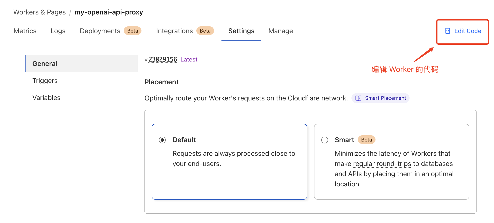
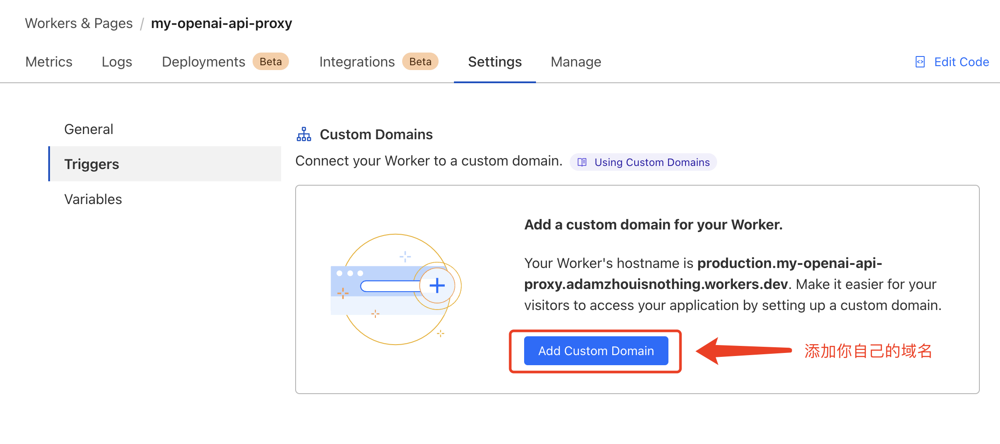

ChatGPT 的 API 一经推出便喜提了 GFW 认证。本方案使用 Cloudflare Worker 代理来自 ChatGPT 客户端的请求，配合一个没有被 GFW 认证的域名，即可在境内实现接入访问。

使用该方案之前你需要先准备好两样东西：

1）一个没有被 GFW 认证的域名，推荐去[狗爹](https://www.godaddy.com/)那里购买。
2）一个 Cloudflare 账号。

### Step by Step

1. 新建一个 Cloudflare Worker

Cloudflare 个人用户管理界面 -> Workers & Pages -> 点击「Create application」 -> 直接点击「Create Worker」 -> 起个靓一点的名字 -> 点击「Deploy」

至此 Cloudflare 的 Worker 便创建好了，下一步开始修改 Worker 的代码，使其能够代理来自 ChatGPT 客户端的请求。

2. 修改 Cloudflare Worker 的代码

在左侧的代码编辑器中，删除现有的所有代码，然后复制粘贴 [src/entry.js](src/entry.js) 的代码到代码编辑器。最后点击编辑器右上角的「Deploy」按钮部署该代码。

3. 绑定域名

ALL THINGS DONE。等待片刻，就可以通过你自己的域名来代替 OpenAI 的 API BASE 地址了，比如要请求 ChatGPT 的 Chat Completion API，把官方 API 地址 ``https://api.openai.com/v1/chat/completions`` 换成 ``https://${YOUR_DOMAIN}/v1/chat/completions`` 即可。鉴于 Cloudflare 给每个用户提供每天 10 万次的免费请求额度，所以轻度使用基本是零成本无负担。

> 本方案参考了[ noobnooc 的仓库下的帖子](https://github.com/noobnooc/noobnooc/discussions/9)，并在这之上做了整理修改。
